# Atodolist

A simple To-do-List application with command-line based interface written in Java.

## Description
The application is command-line based. User will be guided to select options from the menu by enter the option number. 

### Functionalities:
- Create new tasks with title, project, due date, and completion status. 
- Add, edit, update, mark as done, and remove tasks from the todolist.
- Display todolist by date or project. 
- Save and load task list to file automatically.

## Class Diagram
The program contains 5 classes:
- Main
- ToDoList
- Menu
- Task
- FileManager

Their relationships are shown as below:

## User Manual
### Main Menu
When the program start running, a welcome message will be displayed, following the main option menu.

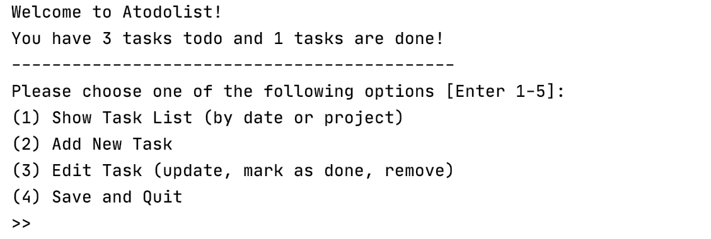

### Show Task List
When user enters **[1]** in main menu, the program will enter _Show List_ menu.
If there is no task in the tasklist, a following message will be displayed:
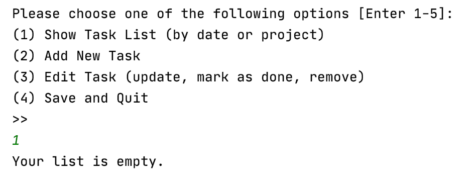

After user has added tasks to the list, user can choose to show the task list by date or project by entering **[1]** or **[2]**:

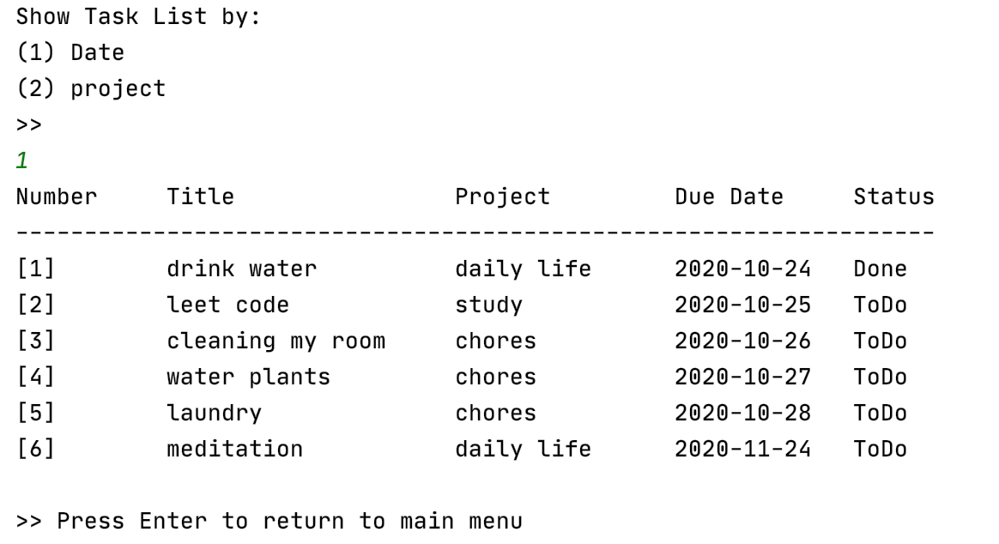

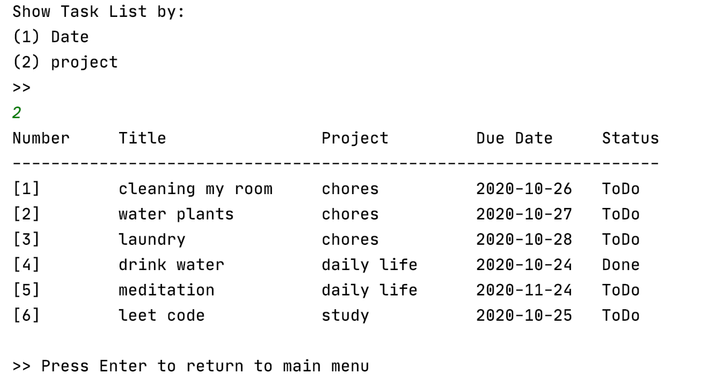

User can now press **[ENTER]** key to return to main menu.

### Add New Task
When user enters **[2]** in main menu, the program will enter _Add New Task_ menu.
User will enter the required field to add a new Task.

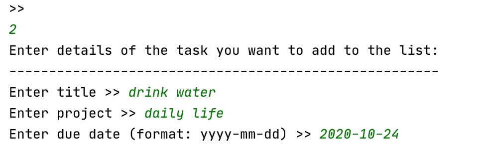

If user doesn't enter required information, corresponding message will be prompted, and the program will return to previous step and ask user to enter details again.
- Missing entries

- Wrong date format:

- Passed date: 

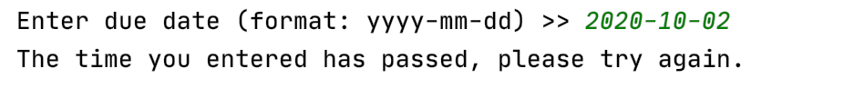

After user has entered required information in the right format, the task will be saved to the task list. The status of new tasks will be "To-do" by default.

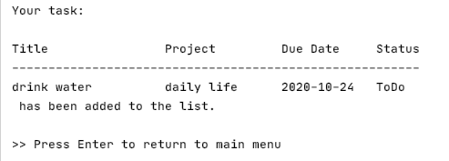

User now can press **[ENTER]** to return to main menu.

### Edit Task
When user enters **[3]** in main menu, the program will enter _Edit Task_ menu.

A full tasklist will be shown, and user will be asked to enter the number of task to be edited:

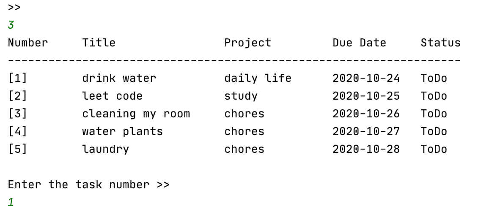

 After user has chosen the task, edit options will be displayed:
 
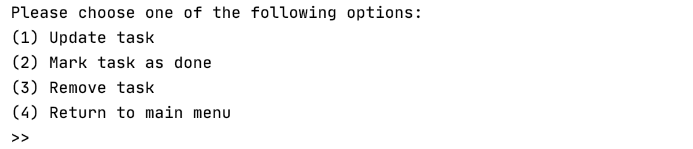

#### Option 1: Update Task
Enter **[1]** to update the task. Similar to _Add Task_ interface, user will be asked to enter required fields.

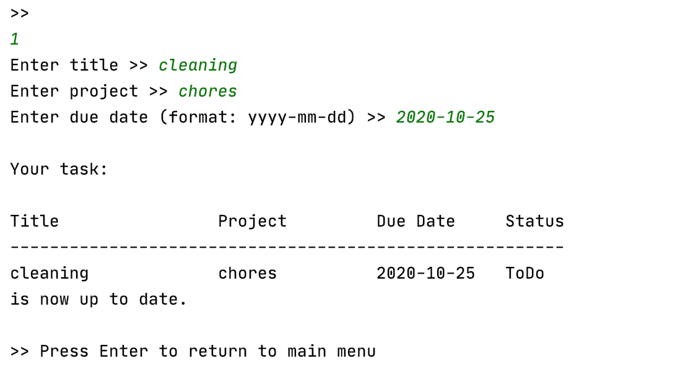

#### Option 2: Mark As Done
Enter **[2]** to mark the task as done.

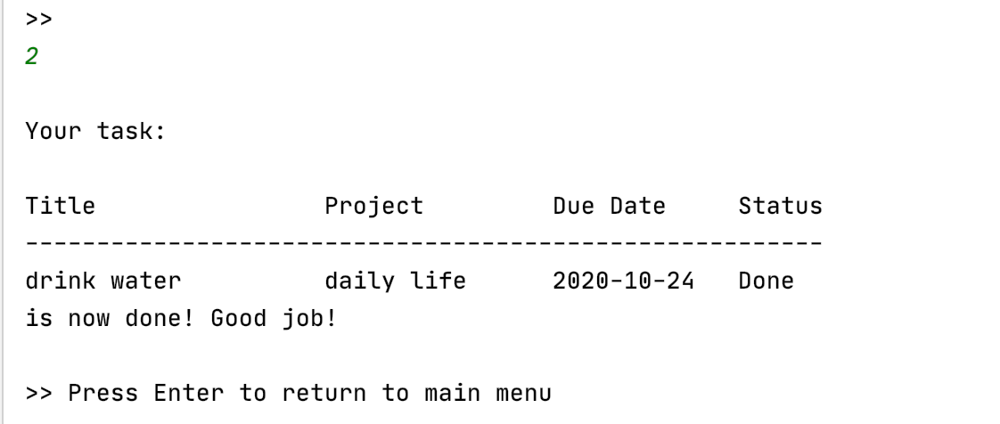

#### Option 3: Remove Task
Enter **[3]** to remove the task from tasklist.

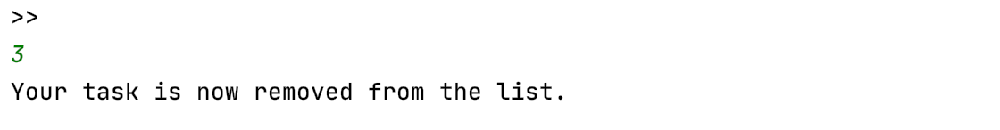

#### Option 4: Return To Main Menu
Enter **[4]** to return to main menu.

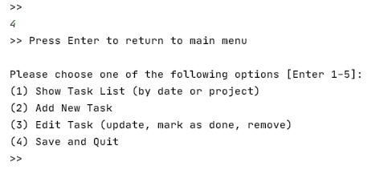

### Save and Quit
When user enters **[4]** in main menu, the program will save all changes in the task list and prompt user the good-bye message:

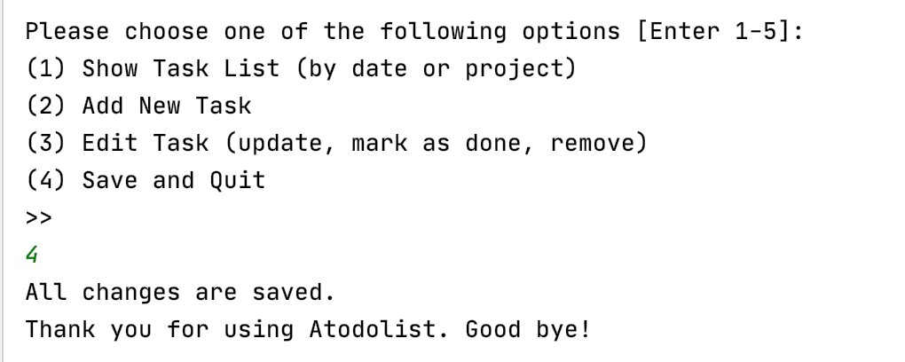
